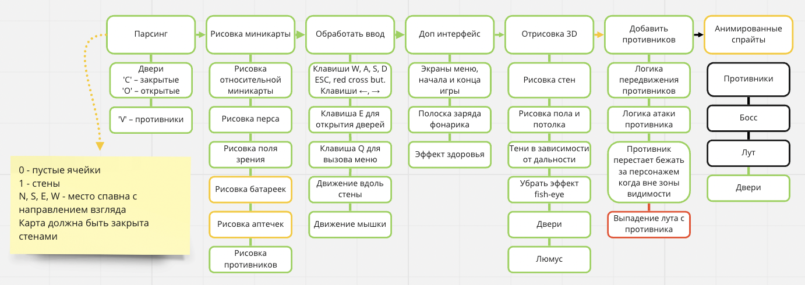

# Cub3d
*A pseudo-3d game based on a raycasting technology, in the spirit of Doom (1993)*


## Project aims
- Use of C
- Use of some math
- Get to know [Raycasting](https://en.wikipedia.org/wiki/Ray_casting#Concept) technology
- Mandatory use of [minilibX](https://harm-smits.github.io/42docs/libs/minilibx) (tiny graphical library)
- Teamwork skills development

---

## How to use
1. Type `git clone git@github.com:tsegeron/Cub3d.git` in terminal to clone the repo
```
git clone git@github.com:tsegeron/Cub3d.git
```
2. Type `cd Cub3d` in terminal to change the directory
```
cd Cub3d
```
3. Type `make bonus` in terminal to compile the program
```
make bonus
```
4. Run with `./cub3d_bonus maps/map3.cub` (all maps are listed in maps directory, you can edit them)
```
./cub3d_bonus maps/map3.cub
```
5. To exit use `esc` or key `q` + `exit`

<br/><br/>

> [minilibX](https://harm-smits.github.io/42docs/libs/minilibx) works only on unix, not adapted for other operating systems

---

## Credits

This two-person project was done with [mseastar](https://github.com/mseastar).

---

## Quick look


---

## Workflow

